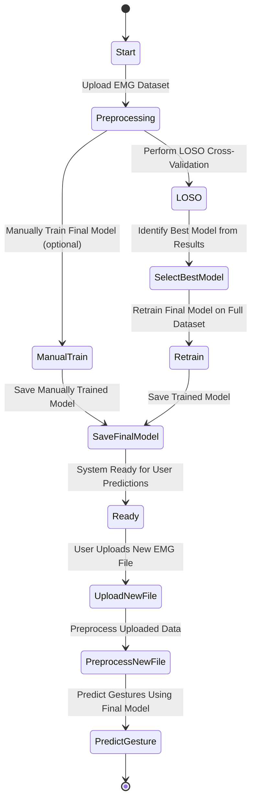

# 📄 README – EMG Signal Gesture Recognition System

## 📊 Workflow Diagram



## 📂 Project Structure

```
EMG-signal-MachineLearningModel/
│
├── training/
│   ├── loso_cross_validation.py
│   ├── final_model_trainer.py
│   ├── metrics.py
│
├── utils/
│   ├── feature_extraction.py
│
├── subjects_csv/
├── rf_fast_results/
├── saved_models/
├── uploads/
├── app.py
├── README.md
├── requirements.txt
└── EMG_Project_Report.docx
```

## ⚙️ Main Applications Explained

| Python File                     | Purpose and Functionality |
|----------------------------------|----------------------------|
| `utils/feature_extraction.py`    | Preprocesses raw EMG signals, applies bandpass filtering, extracts features (RMS, ZCR, WL), handles class balancing (especially downsampling class 0), and segments windows for training. |
| `training/loso_cross_validation.py` | Runs Leave-One-Subject-Out (LOSO) cross-validation to evaluate multiple model configurations (Random Forests, SVMs) on each subject separately. Saves detailed results for later analysis. |
| `training/final_model_trainer.py` | Reads LOSO results, selects the best model based on weighted F1 Score, retrains this model using all the subject data, and saves it as the official final model. |
| `training/metrics.py`            | Computes Accuracy, Precision, Recall, and F1 Score. Also provides confusion matrix visualization for model evaluation. |
| `app.py` (optional)              | A friendly web interface (Streamlit) where users can upload new EMG recordings, predict gestures using the final trained model, and visualize the results. |
| `subjects_csv/`                  | Contains one processed CSV per subject (after feature extraction). |
| `rf_fast_results/`               | Contains intermediate results from LOSO cross-validation (Random Forest and SVM model performances). |
| `uploads/`                       | Folder where users upload a new .txt file for gesture prediction (real-world testing). |
| `saved_models/`                  | Stores the final trained model (classifier + scaler) in a `.pkl` format (Joblib serialization). |

## 📜 Requirements

Install the project dependencies:

```bash
pip install -r requirements.txt
```

Key packages:
- `numpy`
- `pandas`
- `scikit-learn`
- `scipy`
- `matplotlib`
- `seaborn`
- `streamlit` (optional)

## 🚀 Quick Start

1. **Prepare Data:** Organize your raw EMG .txt files into subject folders.
2. **Run Preprocessing:**  
   - Use `feature_extraction.py` to extract features.
3. **Cross-Validation:**  
   - Execute `loso_cross_validation.py` to generate evaluation results.
4. **Train Final Model:**  
   - Run `final_model_trainer.py` to select the best configuration and train the final classifier.
5. **Predict Gestures:**  
   - Upload new EMG data to `uploads/` and predict gestures using the app or a script.

---

> Designed with ❤️ by **Rached El Bitar**, **Mohamed El Nakouzi**, and **Daniel Nassar**
